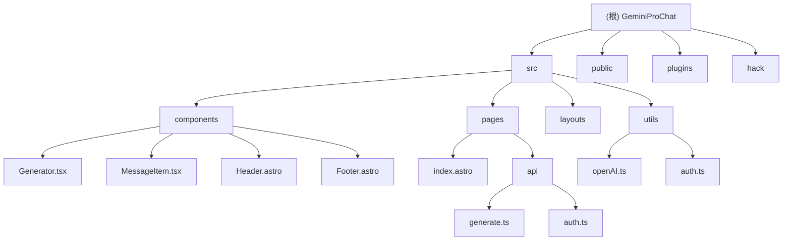

# GeminiProChat 项目文档

## 变更记录 (Changelog)

- **2025-09-12**: 初始化项目文档，完成架构分析和模块索引

## 项目愿景

GeminiProChat 是一个基于 Google Gemini AI 的极简聊天界面项目，旨在提供一个轻量级、易于部署的 Web 聊天应用，支持与 Google Gemini Pro 模型进行对话。

## 架构总览

### 技术栈
- **前端框架**: Astro + SolidJS
- **样式**: UnoCSS + 自定义 CSS
- **AI 集成**: Google Gemini Pro API (`@fuyun/generative-ai`)
- **部署支持**: Vercel、Netlify、Docker
- **PWA**: 支持渐进式 Web 应用
- **包管理**: pnpm

### 系统架构
```
┌─────────────────┐    ┌─────────────────┐    ┌─────────────────┐
│   前端界面      │────│   API 路由      │────│  Gemini API     │
│  (Astro/SolidJS)│    │    (Astro)      │    │     服务       │
└─────────────────┘    └─────────────────┘    └─────────────────┘
         │                       │                       │
         └───────────────────────┼───────────────────────┘
                                │
                    ┌─────────────────┐
                    │   认证与安全    │
                    │  (签名/密码)     │
                    └─────────────────┘
```

## 模块结构图



## 模块索引

| 模块路径 | 职责 | 技术栈 | 关键文件 |
|---------|------|--------|----------|
| `src/components` | UI 组件库 | SolidJS + Astro | Generator.tsx, MessageItem.tsx |
| `src/pages` | 页面路由和 API 端点 | Astro | index.astro, api/generate.ts |
| `src/utils` | 工具函数和 API 封装 | TypeScript | openAI.ts, auth.ts |
| `src/layouts` | 页面布局模板 | Astro | Layout.astro |
| `public` | 静态资源 | - | icon.svg, PWA 图标 |
| `plugins` | Astro 插件 | JavaScript | disableBlocks.ts |
| `hack` | 部署脚本 | Shell | docker-env-replace.sh |

## 运行与开发

### 环境要求
- Node.js v18+
- pnpm 包管理器
- GEMINI_API_KEY

### 开发命令
```bash
# 安装依赖
pnpm install

# 开发模式
pnpm dev

# 构建
pnpm build

# 代码检查
pnpm lint
```

### 部署选项
- **Vercel**: 一键部署（推荐）
- **Netlify**: 支持 Edge Functions
- **Docker**: 容器化部署
- **Railway**: 云平台部署

## 测试策略

当前项目主要依靠以下方式进行质量保证：
- ESLint 代码规范检查
- TypeScript 类型安全
- 手动测试和用户反馈
- GitHub Actions CI/CD 流程

## 编码规范

### TypeScript 配置
- 严格模式启用
- 路径别名 `@/*` 指向 `src/*`
- 支持 SolidJS JSX

### 代码风格
- 使用 ESLint 进行代码规范
- 支持 .astro 文件
- 使用 Prettier 格式化

### 命名规范
- 组件文件：PascalCase (Generator.tsx)
- 工具函数：camelCase (generateSignature)
- 常量：UPPER_SNAKE_CASE

## AI 使用指引

### API 使用
- 使用 `@fuyun/generative-ai` 包
- 支持 Gemini 2.0 Flash 模型
- 流式响应处理
- 自定义 API 基础 URL 支持

### 安全措施
- 请求签名验证（生产环境）
- 站点密码保护
- 环境变量敏感信息保护
- 安全设置（禁用所有内容过滤）

## 相关文件清单

### 核心配置文件
- `package.json` - 项目依赖和脚本
- `astro.config.mjs` - Astro 配置
- `tsconfig.json` - TypeScript 配置
- `unocss.config.ts` - UnoCSS 配置

### 部署配置
- `Dockerfile` - Docker 容器配置
- `docker-compose.yml` - Docker Compose
- `vercel.json` - Vercel 部署配置
- `netlify.toml` - Netlify 部署配置

### 环境变量
- `GEMINI_API_KEY` - Google API 密钥
- `API_BASE_URL` - 自定义 API 基础 URL
- `SITE_PASSWORD` - 站点访问密码
- `PUBLIC_SECRET_KEY` - 签名密钥
- `HEAD_SCRIPTS` - 头部脚本注入

### 忽略文件
- `.gitignore` - Git 忽略规则
- `.dockerignore` - Docker 忽略规则
- `.eslintignore` - ESLint 忽略规则